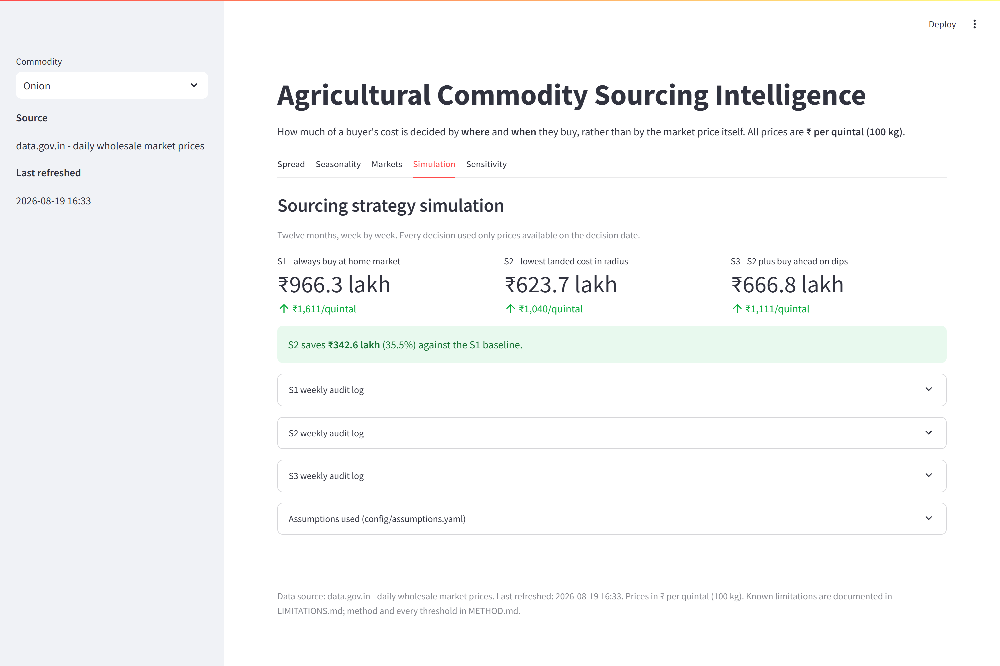
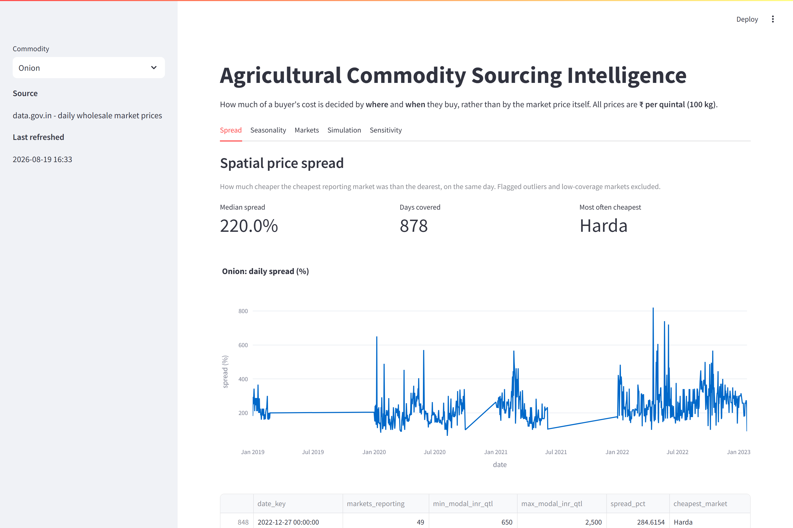
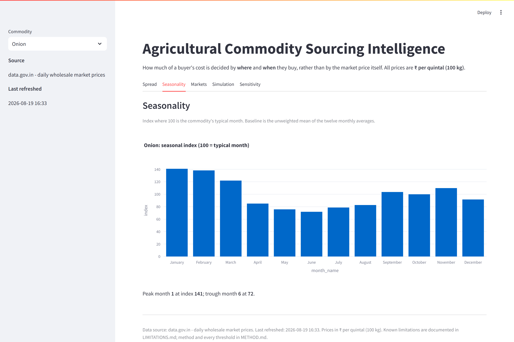
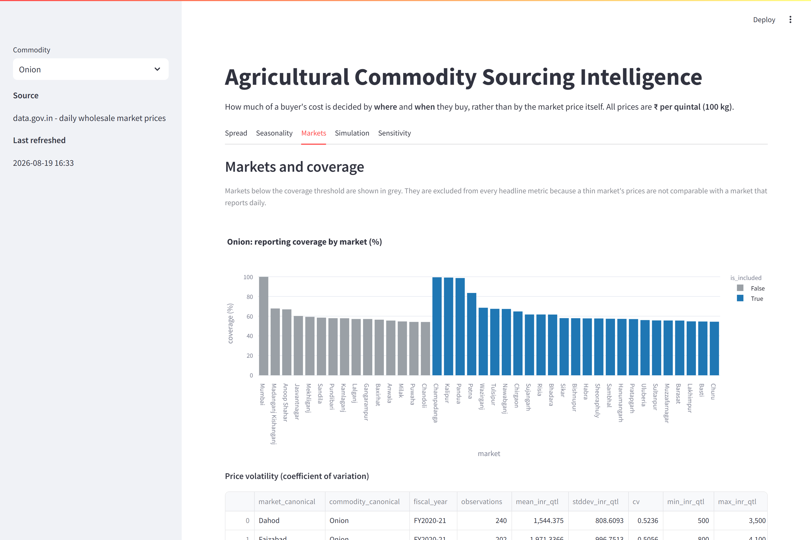
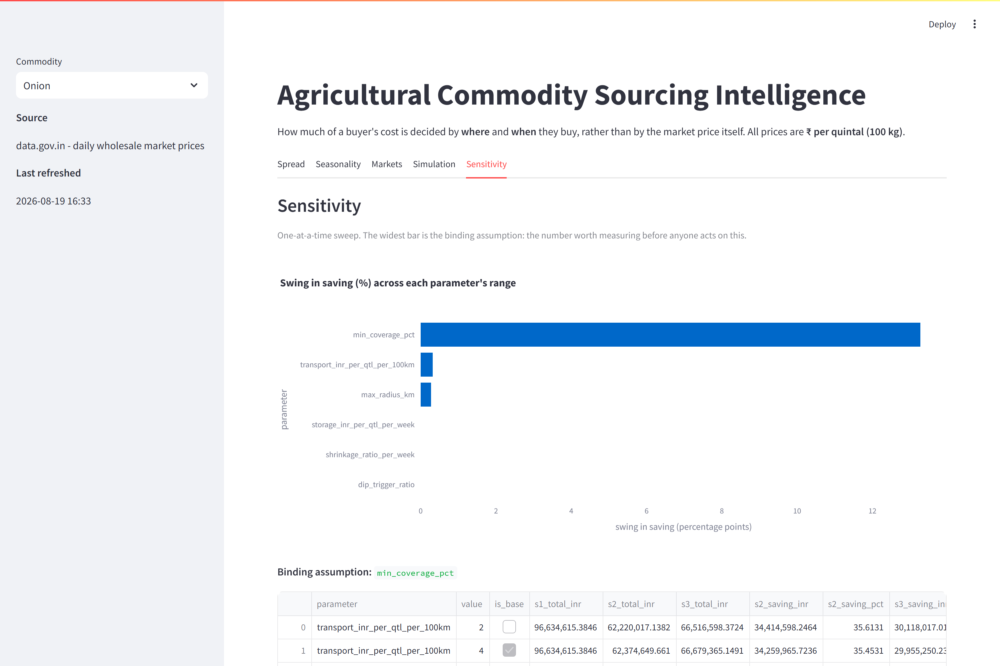

# Agricultural Commodity Sourcing Intelligence

**For a buyer purchasing a fixed monthly tonnage of a perishable commodity,
how much of the cost is decided by *where* and *when* they buy, rather than
by the market price itself?**

Built on **1,307,905 observed wholesale price records** from India's national
mandi archive (2019-2023, 8 states, 3 commodities), with a landed-cost model
and a week-by-week simulation of three sourcing strategies.



---

## The answer

> ### The saving is 11% to 38%, median 33%. Which number you get depends on where you buy today, not on where you could buy.

The best reachable landed cost is **₹1,039-1,065 per quintal almost
regardless of your starting market.** All the variation is in the baseline:

| Your current market | Its own price | Best reachable | Saving |
|---|---|---|---|
| Siyana | ₹1,169/qtl | ₹1,039/qtl | **11.1%** |
| Bahedi | ₹1,238/qtl | ₹1,040/qtl | **16.0%** |
| Muradabad | ₹1,561/qtl | ₹1,045/qtl | **33.0%** |
| Sambhal | ₹1,611/qtl | ₹1,040/qtl | **35.5%** |
| Nawabganj | ₹1,719/qtl | ₹1,065/qtl | **38.0%** |

**The opportunity is not that some markets are cheap. It is that some buyers
are anchored to an expensive one.** The first question to ask is not "where
is cheapest" but "how expensive is where I already buy".

Two results worth stating because they contradict the obvious guess:

- **The timing strategy lost money.** S3 (buy ahead on price dips) came in 7%
  worse than S2. Onion shrinks 3% a week and storage costs ₹15/quintal/week;
  together those ate more than the dips returned.
- **Freight is nearly irrelevant here.** Doubling transport cost moves the
  answer by 0.3 percentage points. The binding assumption is *which markets
  you count*: at a 45% coverage bar the saving is 22.2%, at 65% it is 35.5%.

Full one-page version: **[docs/brief.md](docs/brief.md)**.

---

## Two errors this project caught in itself

The build spec carries deliberate tripwires. Both fired, and both were real.

**1. Grade mixing inflated the headline by 15 points.** Markets quote
different grades under one commodity name: Sambhal lists Red onion at ~₹1,608
a quintal, Sikar lists "1st Sort" at ~₹978, Harda lists "Medium" at ~₹830.
They never quote the same variety on the same day. Comparing across them
turned a quality difference into a phantom spatial arbitrage and produced a
**50.4% saving, which collapsed to 35.5%** once the panel was pinned to a
single variety. The tripwire was "a saving above 30% means you have a bug".

**2. A geocoder that hid its own failures.** The first market-mapping run
reported 173 markets as "not found" that plainly exist. It was treating
rate-limit responses as absence. Once throttling was distinguished from a
genuine no-match, 208 of 260 markets resolved, every one validated against
its own state's bounding box.

Neither would have surfaced against synthetic data. Both are documented in
**[LIMITATIONS.md](LIMITATIONS.md)**, along with what is still wrong.

---

## The dashboard

Five tabs, reading only materialised parquet. It never recomputes a metric
and never touches the API, so what is on screen is exactly what the pipeline
produced.

### Spatial price spread

Note the breaks in the line. The archive is not a continuous daily series,
and the chart refuses to draw through days on which nothing was reported.



### Seasonality



### Markets and coverage

Markets below the coverage threshold render in grey. They are excluded from
every headline metric, and the chart says so rather than hiding them.



### Sensitivity

The widest bar is the binding assumption. On this data it is market
selection, not freight.



---

## Running it

```bash
python -m venv .venv
make install
cp .env.example .env          # add your data.gov.in API key
make test                     # 277 tests, no network required
make lint
```

Every target runs against `.venv` if one exists, so the pipeline can never
install itself over a global interpreter.

### Getting the data

**The repository contains the code, not the dataset.** `data/` is gitignored:
the landed archive is roughly 200 MB of parquet, which does not belong in
version control, and it is fully reproducible from the source in one command.

A fresh clone therefore has **no data and the dashboard will render empty
until you build it.** That is deliberate, not an oversight. To populate it:

```bash
make backfill-history         # ~1.31M rows, 15 archives, roughly 25 minutes
make ingest                   # today's live prices (optional)
make all                      # clean -> warehouse -> analytics -> simulation
make sensitivity              # tornado data for the last tab
make dashboard                # streamlit on localhost:8501
```

The backfill is checkpointed per commodity-year. If it is interrupted, run it
again and it resumes from the last completed page rather than restarting.

Two things are worth knowing before the first run:

- **The live resource is a current-day feed.** Querying it for any past
  `arrival_date` returns zero rows. Multi-year history comes from the
  per-year archives listed in `seeds/historical_resources.yaml`, whose schema
  differs and is normalised on ingest.
- **`seeds/market_map.csv` is committed** with 254 geocoded markets, so you
  do not need to re-run the geocoder. If you widen the scope, regenerate it
  with `python tools/geocode_markets.py --limit 300`.

---

## How it is built

```
config/      settings.yaml (thresholds) + assumptions.yaml (business inputs)
ingest/      API client, immutable landing zone, daily + backfill entrypoints
transform/   parse -> validate -> canonicalise -> clean -> warehouse
analytics/   version-controlled SQL, one file per question
simulate/    geo, costs, strategies, week loop, sensitivity
dashboard/   Streamlit app, reads materialised parquet only
tools/       one-off utilities: market geocoding, screenshot capture
tests/       277 tests: unit, contract, property, golden and end-to-end
```

| | |
|---|---|
| Tests | 277 passing |
| Coverage | 94% on `ingest` / `transform` / `simulate` |
| Suite runtime | under 90 seconds, no network |
| Records processed | 1,307,905 raw -> 535,547 clean |

Method and every threshold: **[METHOD.md](METHOD.md)**.
Data quality report, regenerated on every run: **[docs/data_quality.md](docs/data_quality.md)**.

---

## Design rules that are not negotiable

- **No fabricated data.** If a fetch fails it raises. Missing market-days
  stay missing; they are never interpolated. If no candidate market has a
  usable price, the simulation stops rather than inventing one.
- **No look-ahead.** Strategies receive a `PriceView` constructed already
  filtered to the decision date, so seeing a future price is structurally
  impossible rather than merely discouraged. Three tests assert it, including
  one that introspects every public method.
- **Every rejected row has a reason** from a fixed enum, and every reason has
  a count in `docs/data_quality.md`. Scope exclusion is reported separately,
  because a filter you chose is not a data-quality failure.
- **All prices are ₹ per quintal (100 kg).** One tonne is ten quintals, with
  a dedicated test guarding the conversion.
- **A market with no coordinates is never included.** No position means no
  computable freight, so it cannot be a sourcing candidate whatever else it
  has going for it.
- **No magic numbers in code.** Every threshold lives in `config/`, and every
  one that moves the answer is swept in the sensitivity grid.
